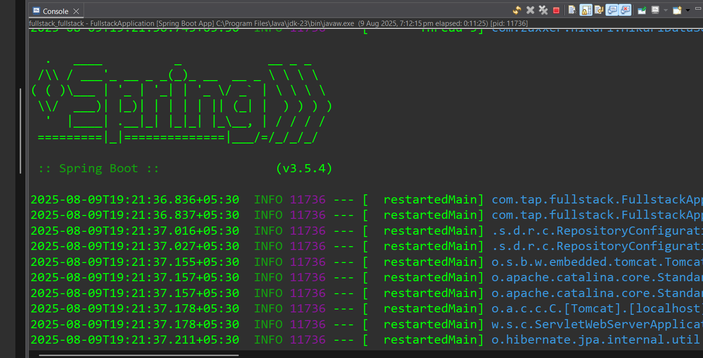
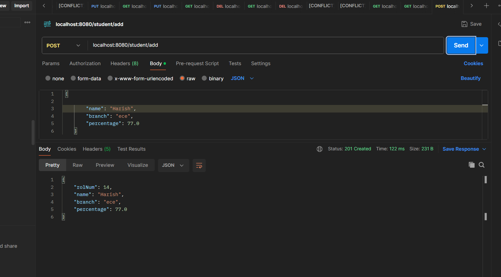
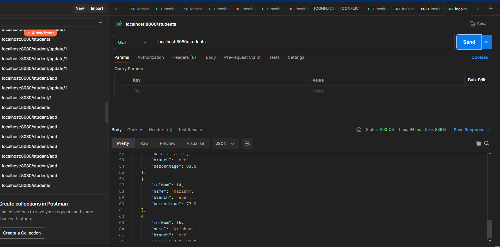
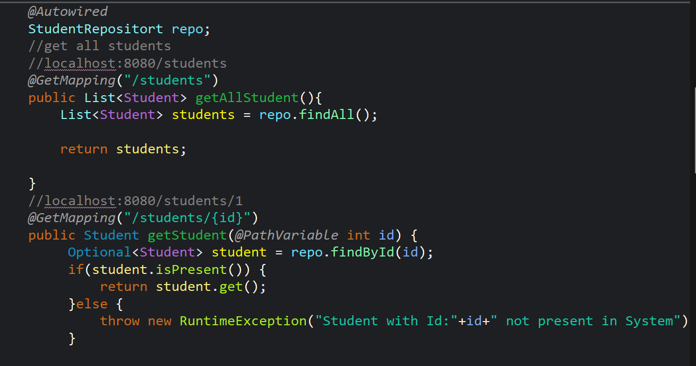
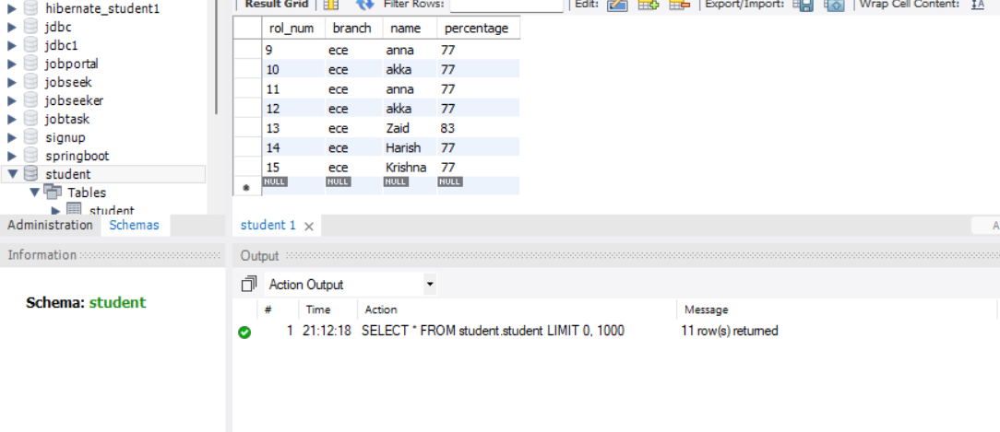

🎓 Student Management REST APIs
This project is a Student Management System implemented using Spring Boot, providing RESTful APIs to perform CRUD (Create, Read, Update, Delete) operations on student data.

✨ Features
✅ Full CRUD operations on student records.

🌐 REST API endpoints implemented with Spring Boot.

💾 Data persistence using a relational database (e.g., MySQL, H2, or any configured DB).

🧪 Tested all APIs thoroughly using Postman to ensure data integrity and correct HTTP responses.

🔗 API Endpoints
HTTP Method	Endpoint	Description
GET	/students	Retrieve list of all students
GET	/students/{id}	Retrieve student by ID
POST	/students	Create a new student
PUT	/students/{id}	Update an existing student
DELETE	/students/{id}	Delete a student by ID

🛠️ Technologies Used
🖥️ Java 11+

🚀 Spring Boot

📦 Spring Data JPA

🌐 RESTful Web Services

🔧 Postman (for API testing)

⚙️ Maven/Gradle (build tool)

🗄️ Database: MySQL / H2 / PostgreSQL (customize as per your project)

🚀 How to Run the Project
🔽 Clone the repository:

bash
Copy
Edit
git clone <repository-url>
📂 Navigate to the project directory:

bash
Copy
Edit
cd student-management
⚙️ Configure your database in application.properties or application.yml.

▶️ Build and run the Spring Boot application:

bash
Copy
Edit
mvn spring-boot:run
🧪 Use Postman or any API testing tool to test the endpoints.

🧪 Postman Testing Summary
🔍 Performed GET requests to fetch all students and individual student records.

✏️ Used POST to create new student entries.

🛠️ Tested PUT requests to update existing student information.

❌ Verified DELETE operations successfully remove student data.

📩 Validated proper HTTP response codes (200, 201, 404, 400, etc.) for each operation.

🛡️ Ensured data integrity and error handling on invalid input.
Images:

